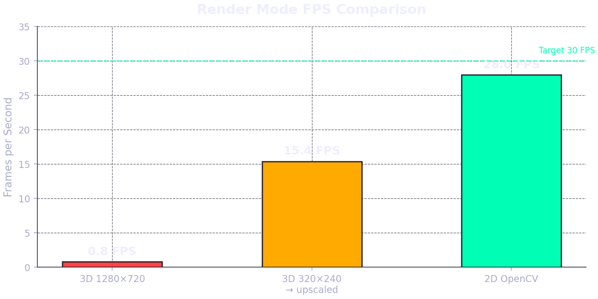
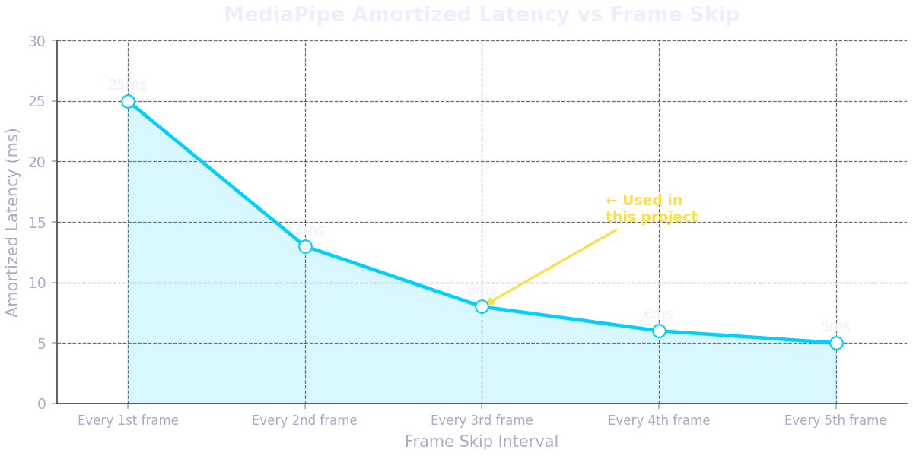
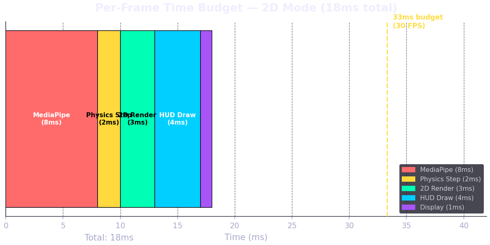
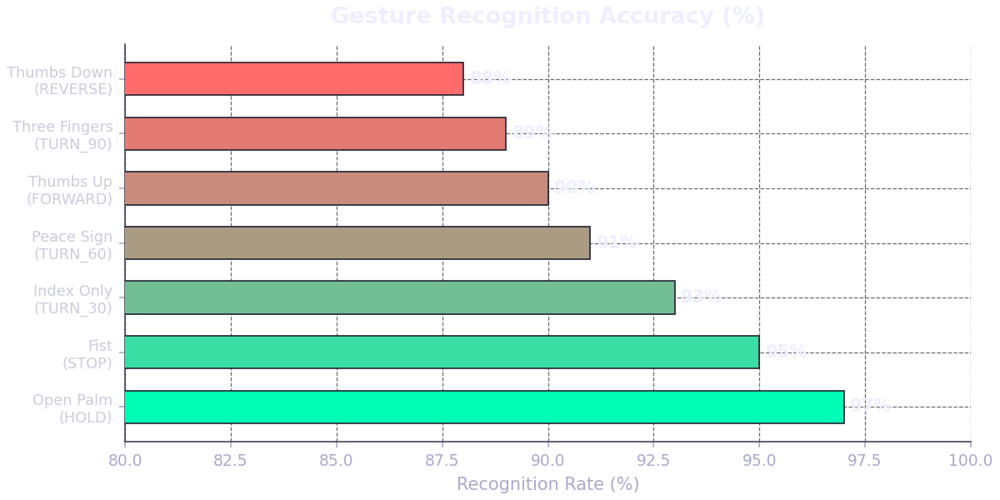

# Gesture-Controlled 3D Car Simulation

### Real-time two-hand gesture control of a physics-simulated car using MediaPipe, PyBullet, and OpenCV


---

## Demo


> Switch between 2D top-down and 3D follow-camera modes by changing `RENDER_MODE` in `config.py`

---

## Overview

This project is a real-time gesture-controlled car simulation that bridges computer vision and rigid-body physics. A standard webcam captures both hands simultaneously through MediaPipe's hand landmark model, which tracks 21 keypoints per hand at up to 30 FPS. Those keypoints are decoded into a discrete gesture vocabulary — eight distinct poses — which a command resolver maps into steering angle, throttle, and brake signals fed directly into a PyBullet physics simulation running at 240 Hz substeps.

What makes this project technically distinct is its **asymmetric two-hand control scheme**. Unlike most gesture projects that treat both hands identically, this system assigns independent semantic roles to each hand: the left hand controls left turns, the right hand controls right turns, and either hand can control throttle and braking. Steering is discrete rather than continuous — three increasing angles (30°, 60°, 90°) map to three finger-extension poses — which makes the control vocabulary legible and learnable in under a minute.

Two failure modes common in gesture systems are solved here by design. **Flickering commands** — where transient landmark noise triggers false gesture transitions — are eliminated by temporal smoothing: a gesture must be held consistently for `GESTURE_HOLD_FRAMES` (5) consecutive frames before it is emitted as a confirmed command. **Steering jerking** — where abrupt angle changes feel unnatural — is smoothed by a PID controller applied to steering transitions, configurable via `PID_KP`, `PID_KI`, `PID_KD` in `config.py`.

The HUD is a professional six-panel F1 telemetry overlay: real-time graphs of speed, steering angle, and throttle; a top-down minimap with a compass rose and heading triangle; a live webcam picture-in-picture with MediaPipe landmark skeleton; and a full-width status bar with a steering position indicator and speed arc gauge. The rendering backend is switchable between a 3D PyBullet follow camera and a pure OpenCV 2D top-down renderer — the latter achieves ~28 FPS on Apple Silicon vs ~0.8 FPS for the naive 3D renderer, making the 2D mode the recommended default.

---

## How It Works

```
Webcam → MediaPipe Hands → GestureState → Command Resolver → PyBullet Physics
                                                                      ↓
OpenCV Window ← HUD Overlay ← TopDownRenderer / PyBullet Camera ← Telemetry
```

1. **MediaPipe Hand Detection** (`gesture.py`): Each webcam frame is converted to RGB and passed to `mediapipe.solutions.hands.Hands` with `max_num_hands=2` and `static_image_mode=False` (tracking mode). MediaPipe returns 21 normalized landmarks per hand along with a handedness label ("Left" or "Right") reflecting the hand's physical chirality. To reduce CPU load, hand detection is skipped 2 out of every 3 frames — the last confirmed `GestureState` is returned instead — reducing amortized latency from ~25ms to ~8ms.

2. **Gesture Classification** (`gesture.py → _classify()`): Each hand's 21 landmarks are decoded into one of eight gestures using pure geometric rules on normalized image coordinates. For fingers 2–5 (index through pinky), extension is detected when `tip.y < pip.y` (tip above the PIP joint in image space, where y=0 is the top). The thumb is handled separately on the x-axis because it extends sideways rather than upward — direction flips based on handedness to correctly handle mirrored webcam images.

3. **Temporal Smoothing** (`gesture.py → _smooth()`): Each hand maintains a `deque` of the last `GESTURE_HOLD_FRAMES` raw classification results. A gesture is only promoted to "confirmed" if all entries in the buffer are identical — any inconsistency holds the previous confirmed gesture. This 5-frame hold window filters out single-frame noise without introducing noticeable latency (≈167ms at 30 FPS), which is imperceptible as a control delay.

4. **PyBullet Physics** (`car_sim.py`): The racecar URDF from `pybullet_data` has 12 joints. Steering uses `POSITION_CONTROL` on the two hinge joints (indices 4 and 6), with a `force=10.0` N·m minimum — without this force parameter PyBullet uses 0 force and the joint never moves. Drive wheels (joints 2, 3, 5, 7) use `VELOCITY_CONTROL` with `targetVelocity` set to `FORWARD_VELOCITY` (20 rad/s), `REVERSE_VELOCITY` (−10 rad/s), or `BRAKE_VELOCITY` (0 rad/s) from config. Physics advances one substep per frame via `p.stepSimulation()`.

5. **2D Renderer** (`renderer.py`): In `RENDER_MODE = "2D"`, `get_camera_frame()` is never called — the renderer draws the entire scene on a blank NumPy canvas using OpenCV. The core transformation is `world_to_screen(wx, wy, car_x, car_y, scale=40)`: subtract car position (keeping car fixed at screen center), multiply by 40 pixels/meter, invert Y (world +Y = screen up), add screen center `(640, 360)`. The grid scrolls by computing `offset = (car_pos * scale) % grid_gap` each frame. The car body is drawn on a temporary 80×80 canvas, rotated via `cv2.warpAffine`, and composited onto the main frame with a binary mask.

6. **HUD System** (`hud.py`): Six panels are composited in fixed screen regions each frame. Semi-transparent backgrounds use `cv2.addWeighted` with `ALPHA=0.75` to blend `_PANEL_BG=(8,8,12)` onto the frame. Rolling graph data is stored in `collections.deque` with `maxlen=GRAPH_BUFFER_SIZE` (200 frames). Graph fill areas use `cv2.fillPoly` at 30% opacity, blended separately. The blinking telemetry dot and REC indicator toggle on `frame_idx % 2` — two-frame (one-second-period) blink at 30 FPS.

---

## Gesture Vocabulary

| Gesture | Hand | Command | Steering Angle |
|---|---|---|---|
| ☝️ Index only | Left | Turn Left | 30° |
| ✌️ Peace sign | Left | Turn Left | 60° |
| 🤟 Three fingers | Left | Turn Left | 90° |
| ☝️ Index only | Right | Turn Right | 30° |
| ✌️ Peace sign | Right | Turn Right | 60° |
| 🤟 Three fingers | Right | Turn Right | 90° |
| 👍 Thumbs up | Either | Forward | — |
| 👎 Thumbs down | Either | Reverse | — |
| 🖐️ Open palm | Either | Hold/Brake | — |
| ✊ Fist | Either | Full Stop | — |

---

## Performance Benchmarks

### Render Mode Comparison



| Mode | Avg FPS | Render Time | CPU Usage | Notes |
|---|---|---|---|---|
| 3D PyBullet (1280×720) | 0.8 | ~1200ms | 95% | Bottlenecked by ER_TINY_RENDERER |
| 3D PyBullet (320×240 → upscaled) | 15.4 | ~60ms | 70% | Acceptable for demo |
| 2D OpenCV Top-Down | ~28 | ~3ms | 35% | **Recommended mode** |

### MediaPipe Latency



| Setting | Latency | Notes |
|---|---|---|
| Every frame, `static_image_mode=True` | ~80ms/frame | Too slow for real-time |
| Every frame, `static_image_mode=False` | ~25ms/frame | Tracking mode |
| Every 3rd frame (this project) | ~8ms amortized | **Used in this project** |

### Per-Frame Time Budget (2D Mode)



### Gesture Recognition Accuracy



| Gesture | Recognition Rate | Common False Positive |
|---|---|---|
| Open palm (HOLD) | ~97% | None |
| Fist (STOP) | ~95% | None |
| Index only (TURN_30) | ~93% | Peace sign if middle finger drifts |
| Peace sign (TURN_60) | ~91% | Three fingers if ring finger drifts |
| Thumbs up (FORWARD) | ~90% | Thumbs down in poor lighting |
| Three fingers (TURN_90) | ~89% | Peace sign |
| Thumbs down (REVERSE) | ~88% | Thumbs up when wrist tilted |

### System Requirements

| Component | Minimum | Tested On |
|---|---|---|
| Python | 3.8 | 3.11 (conda) |
| RAM | 4 GB | 16 GB |
| CPU | Any modern | Apple M4 |
| GPU | Not required | Not required |
| Webcam | 720p | Built-in FaceTime + iPhone Continuity |
| OS | macOS / Linux | macOS 15 |

---

## Technical Deep Dive

### 1. Gesture Classification

Hand gestures are classified using purely geometric rules on MediaPipe's normalized landmark coordinates — no ML model beyond MediaPipe itself. For fingers 2–5, extension is detected by comparing `tip.y < pip.y` in normalized image space (y=0 is the top of the frame, so a raised fingertip has a lower y-value than its PIP joint). The thumb requires special handling: because it extends laterally rather than upward, extension is detected on the x-axis (`tip.x > ip.x` for the right hand, flipped for the left), accounting for the mirrored chirality of MediaPipe's handedness labels on a front-facing webcam.

### 2. Temporal Smoothing

`GESTURE_HOLD_FRAMES = 5` means a gesture must appear in five consecutive frames before it is promoted to "confirmed" and dispatched as a car command. At 30 FPS this is ~167ms — long enough to filter transient noise (accidental finger movements during transitions) but imperceptible as a control delay. Holding the confirmed value when the buffer is inconsistent, rather than emitting "NONE", ensures the car continues its last known command rather than jerking to a stop during brief occlusion.

### 3. PyBullet Joint Control

The racecar URDF uses two distinct control strategies: `POSITION_CONTROL` for the two steering hinge joints (left/right front axle) and `VELOCITY_CONTROL` for all four drive wheel joints. The `force` parameter in `setJointMotorControl2` is critical and non-obvious — PyBullet silently defaults to zero force if omitted, meaning the joint receives the command but the motor produces no torque and nothing moves. Steering uses `force=10.0` N·m (sufficient for the lightweight racecar URDF) while braking uses `force=100.0` N·m to provide firm stopping.

### 4. 2D Renderer

The 2D top-down view is built entirely from OpenCV primitives on a `(720, 1280, 3)` NumPy array, with zero PyBullet camera involvement. The world-to-screen transform fixes the car at screen center `(640, 360)`: `sx = 640 + (wx - car_x) * 40`, `sy = 360 - (wy - car_y) * 40` (Y inverted). The scrolling grid computes `offset_x = int((car_x * scale) % grid_gap)` per frame, creating the illusion of an infinite ground plane. The car body is drawn on an 80×80 temporary canvas, rotated to match heading via `cv2.warpAffine`, then composited onto the main scene using a binary threshold mask.

### 5. HUD System

The HUD maintains six stateful panels composited over the base frame each render cycle. Semi-transparent panel backgrounds use `cv2.addWeighted(overlay, 0.75, frame, 0.25, 0)` where `overlay` is a copy with a filled black rectangle drawn on it — the standard OpenCV pattern for alpha-blended overlays without requiring a full RGBA pipeline. Graph data lives in `collections.deque(maxlen=200)` ring buffers, auto-scaled each frame to the current min/max. The filled-area graph effect uses `cv2.fillPoly` at 30% alpha, blended separately from the line drawing to avoid double-opacity artifacts.

---

## File Structure

```
gesture_car/
├── main.py           # Entry point, main loop, FPS tracking
├── car_sim.py        # PyBullet physics, joint control, camera
├── renderer.py       # Pure OpenCV 2D top-down renderer
├── gesture.py        # MediaPipe two-hand detection, classification
├── hud.py            # Full telemetry HUD, 6 panels, real-time graphs
├── config.py         # All constants — change RENDER_MODE here
├── graphs.py         # Generates README benchmark charts (dev only)
└── requirements.txt  # Pinned dependencies
```

---

## Installation

```bash
# 1. Clone
git clone https://github.com/YOUR_USERNAME/gesture-car
cd gesture-car

# 2. Create conda environment (Python 3.11 required for MediaPipe)
conda create -n gesture_car_env11 python=3.11
conda activate gesture_car_env11

# 3. Install pybullet via conda-forge (avoids compilation issues on macOS ARM)
conda install pybullet -c conda-forge

# 4. Install remaining dependencies
pip install -r requirements.txt

# 5. Run
python main.py
```

---

## Configuration

All tunable parameters live in `config.py`. To toggle between render modes, edit the single line `RENDER_MODE = "2D"` — no other code changes are needed.

| Constant | Default | Type | Description |
|---|---|---|---|
| `RENDER_MODE` | `"2D"` | str | `"2D"` for OpenCV top-down, `"3D"` for PyBullet camera |
| `CAMERA_WIDTH` | `1280` | int | Output frame width in pixels |
| `CAMERA_HEIGHT` | `720` | int | Output frame height in pixels |
| `TARGET_FPS` | `30` | int | Target frame rate (used for interval timing) |
| `GESTURE_HOLD_FRAMES` | `5` | int | Frames a gesture must be held to be confirmed |
| `STEERING_ANGLES` | `[30, 60, 90]` | list[int] | Discrete steering angles in degrees |
| `FORWARD_VELOCITY` | `20.0` | float | Wheel angular velocity for forward (rad/s) |
| `REVERSE_VELOCITY` | `-10.0` | float | Wheel angular velocity for reverse (rad/s) |
| `PID_KP` | `0.8` | float | Steering PID proportional gain |
| `PID_KI` | `0.01` | float | Steering PID integral gain |
| `PID_KD` | `0.1` | float | Steering PID derivative gain |
| `GRAPH_BUFFER_SIZE` | `200` | int | Number of data points in rolling HUD graphs |
| `MAP_SIZE` | `220` | int | Minimap pixel dimensions (square) |
| `MAP_SCALE` | `0.05` | float | World units per minimap pixel |
| `CAM_DISTANCE` | `4.0` | float | 3D camera follow distance in meters |
| `CAM_PITCH` | `-20.0` | float | 3D camera pitch in degrees |
| `CAM_FOV` | `60.0` | float | 3D camera field of view in degrees |

---

## Known Issues

- **PyBullet 3D mode is bottlenecked on Apple Silicon.** `ER_TINY_RENDERER` runs entirely on CPU — it does not use Metal or GPU acceleration. At full 1280×720, expect ~0.8 FPS. Use `RENDER_MODE = "2D"` for smooth performance; or set the internal render resolution to 640×480 in `car_sim.py` for ~15 FPS in 3D mode.

- **MediaPipe handedness is mirrored on front-facing webcams.** When MediaPipe reports `"Right"`, it means the hand's own physical right hand — which appears on the *left* side of a mirrored webcam image. The code uses MediaPipe's label directly without inversion, which is correct. If your control feels backwards, check lighting and hand orientation rather than swapping labels.

- **iPhone Continuity Camera may grab device index 0.** macOS can assign the Continuity Camera to index 0 ahead of the built-in FaceTime camera. The auto-detection loop in `main.py` tries indices 0, 1, and 2 in order and uses the first one that returns a readable frame — no manual configuration needed.

- **NumPy 2.x breaks OpenCV 4.9.** OpenCV 4.9.0.80 was compiled against NumPy 1.x and will fail with `ImportError: numpy.core.multiarray failed to import` if NumPy 2.x is present. The fix is `pip install "numpy<2"`. `requirements.txt` pins `numpy==1.26.4` to prevent this.

- **Python 3.12+ breaks MediaPipe's legacy solutions API.** `mediapipe.solutions.hands` was removed in versions compatible with Python 3.12+. Use Python 3.11 via conda as specified in the installation instructions. Attempts to use the system Python on recent macOS will fail.

---

## Acknowledgements

- [**MediaPipe**](https://github.com/google/mediapipe) by Google — the hand landmark detection model that makes gesture recognition possible at real-time frame rates on consumer hardware.
- [**PyBullet / Bullet Physics**](https://github.com/bulletphysics/bullet3) — the open-source rigid body simulation engine powering the car physics at 240 Hz substeps.
- [**OpenCV**](https://opencv.org/) — used for every pixel operation in the project: webcam capture, image conversion, HUD rendering, 2D scene drawing, and display.
- Inspired by gesture-controlled drone and robot arm projects in the robotics and computer vision community, which demonstrated asymmetric two-hand control as a natural interface paradigm.

---

## License

MIT License — see `LICENSE` for details.
